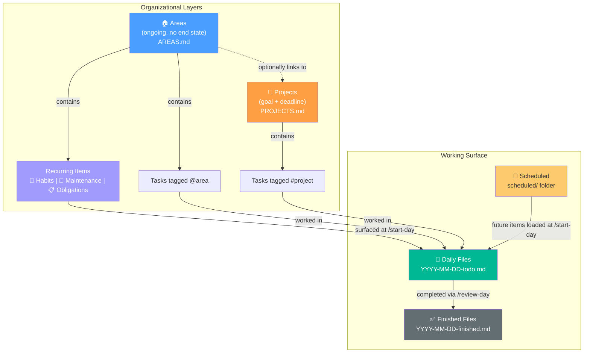
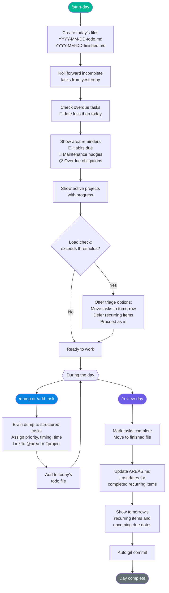
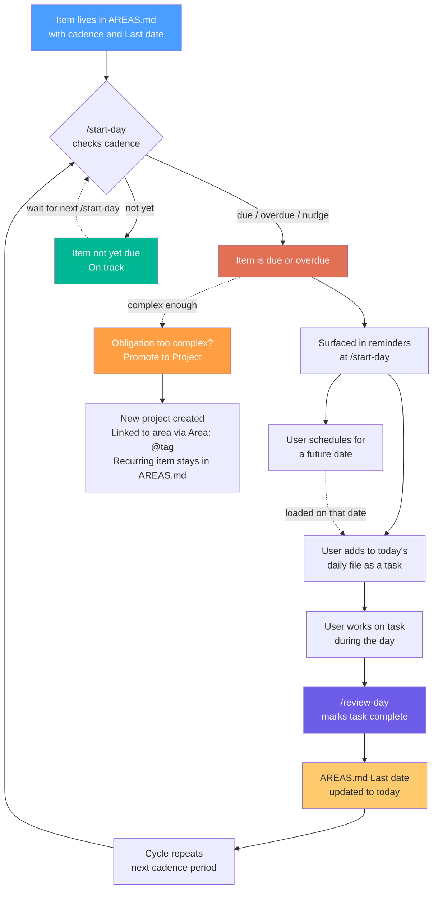
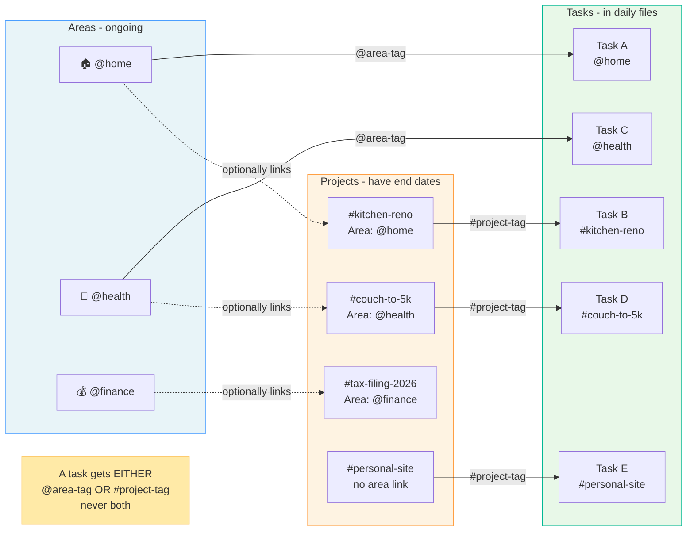
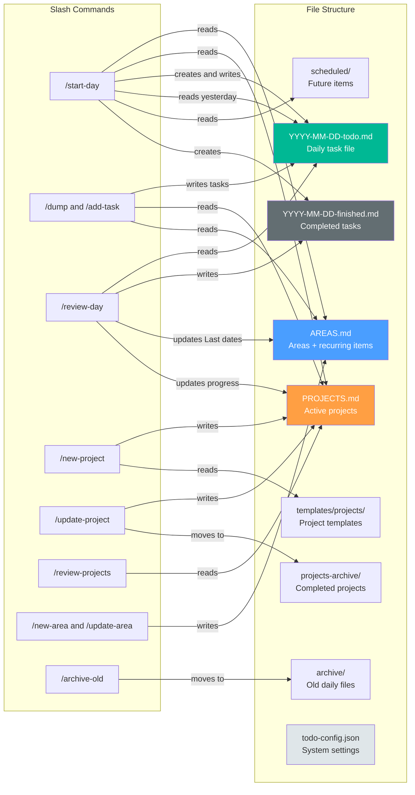
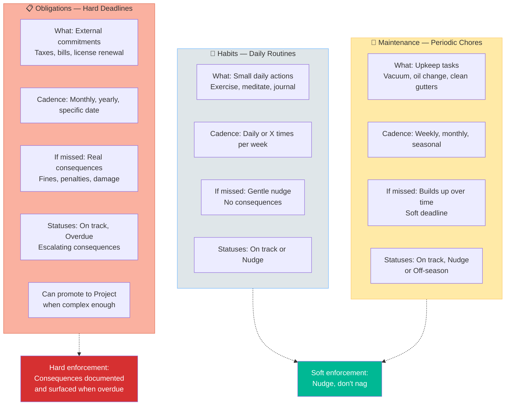

# Action Organizer — System Architecture

**Version:** 2.0.1-claude-code
**Last Updated:** 2026-03-15

This document explains how the Action Organizer system works from end to end. It is intended for someone picking up this system for the first time — or for future-you when you need a refresher on why things are the way they are.

---

## What This System Is

The Action Organizer is a markdown-based task management system powered by Claude Code slash commands. There is no application code, no database, no server. Everything is:

- **Markdown files** — human-readable, version-controlled, portable
- **Claude Code slash commands** — defined in `.claude/commands/`, invoked as `/start-day`, `/dump`, etc.
- **Git** — automatic commits after every meaningful action

Claude Code acts as both the engine and the interface. You talk to it, it reads and writes markdown files, and commits the changes.

---

## 1. System Overview — The PARA Hierarchy

The system follows a modified [PARA method](https://fortelabs.com/blog/para/) (Projects, Areas, Resources, Archives). The two primary organizational layers are **Areas** and **Projects**, which sit above daily tasks.



### Key relationships

- **Areas** are ongoing responsibilities with no end state (Home, Health, Finances). They live in `AREAS.md` and contain recurring items across three tiers.
- **Projects** have a clear goal and a deadline (Kitchen Renovation, Tax Filing 2026). They live in `PROJECTS.md`.
- **A project can optionally belong to an area** — e.g., `#kitchen-reno` links to `@home`. This gives the project context without duplicating structure.
- **Tasks** are the atomic unit of work. Each task belongs to either a project (`#tag`) or an area (`@tag`), never both. This mutual exclusivity keeps things clean — you always know where a task comes from.
- **Daily files** are the working surface. You never edit `AREAS.md` or `PROJECTS.md` directly to do work — tasks flow into daily files, and completed work flows back as status updates.

---

## 2. Daily Workflow

A typical day follows a three-beat rhythm: start, work, review.



### Why this flow matters

**`/start-day` does the thinking for you.** When you sit down in the morning, you don't want to figure out what's overdue, what recurring items need attention, or what rolled forward from yesterday. The command assembles all of that into a single daily file. It also runs a load check — if your plate is overloaded (too many tasks, too many hours estimated, too many overdue items), it tells you and offers triage options. No guilt, just data.

**`/dump` and `/add-task` are the inbox.** Throughout the day, thoughts arrive. `/dump` takes messy, unstructured text and transforms it into structured tasks with priority, timing, and time estimates. It also asks whether to link each task to a project or area. `/add-task` does the same thing for a single task with guided questions.

**`/review-day` closes the loop.** At the end of the day, you mark what's done. Completed tasks move to the finished file. If any completed tasks correspond to area recurring items, their "Last" date gets updated in `AREAS.md`. The command also shows what's coming tomorrow — upcoming due dates and recurring items — so you go to bed knowing what's ahead.

### Task rollover

Incomplete tasks don't disappear. When `/start-day` runs, it reads yesterday's todo file and carries forward anything not marked complete. Rolled-forward tasks get a `📌 Carried over from: YYYY-MM-DD` note so you can see how long something has been lingering.

---

## 3. Area Item Lifecycle

Recurring items are the heartbeat of the Areas system. They follow a cycle: live in `AREAS.md`, get surfaced when due, get worked on in a daily file, and update their "Last" date when completed.



### How the cycle works

1. **The item lives in `AREAS.md`** with a description, cadence (e.g., "Every week (Sat)"), and the date it was last completed.
2. **`/start-day` checks the math.** If today's date minus the "Last" date exceeds the cadence, the item shows up in your reminders.
3. **You add it to today's file** — or schedule it for a future date if today is too full.
4. **You complete it** during `/review-day`, and the system updates the "Last" date in `AREAS.md`.
5. **The cycle resets.** Next time `/start-day` runs and the cadence has elapsed, the item surfaces again.

The item in `AREAS.md` is the **source of truth** — what appears in your daily file is a working copy. This means recurring items are never "lost" even if you delete a daily file.

### Promotion to project

Sometimes a recurring item becomes too complex for a single task. Filing taxes, for example, involves gathering documents, choosing software, filling forms, and reviewing. When that happens, you can promote the item to a full project via `/update-area`. The project gets linked to the area (`**Area:** @finance`), but the recurring item stays in `AREAS.md` — because taxes come back every year.

---

## 4. Project-Area Relationship

Projects and Areas serve different purposes but connect through a clear linking system.



### Why mutual exclusivity?

A task tagged `#kitchen-reno` already inherits its area context from the project's `**Area:** @home` field. If the task also had `@home`, that would be redundant and create ambiguity about where to look for it. The rule is simple:

- **If the task is part of a project**, use `#project-tag`. The area context comes from the project.
- **If the task is a standalone area responsibility** (not part of any project), use `@area-tag`.

### What happens when a project completes?

When a project finishes, it gets archived to `projects-archive/`. But the area persists — it has no end state. The `#kitchen-reno` project may be done, but `@home` keeps going with its recurring items. The project simply disappears from the area's cross-reference list.

---

## 5. File Structure and Command Relationships

Every file in the system has a clear purpose, and every slash command knows exactly which files it reads and writes.



### File-by-file breakdown

| File | Purpose | Created by | Updated by |
|------|---------|------------|------------|
| `AREAS.md` | Stores all areas and their recurring items with cadence and Last dates | `/new-area` | `/update-area`, `/review-day` |
| `PROJECTS.md` | Active projects with status, progress, goals, and linked area | `/new-project` | `/update-project`, `/review-day`, `/link-task` |
| `YYYY-MM-DD-todo.md` | Today's working task list | `/start-day` | `/dump`, `/add-task`, `/refine`, `/link-task` |
| `YYYY-MM-DD-finished.md` | Completed tasks for the day | `/start-day` | `/review-day` |
| `scheduled/` | Tasks scheduled for future dates | `/dump`, `/add-task` | `/start-day` (reads and moves to daily file) |
| `archive/` | Daily files older than 3 days | `/archive-old` | -- |
| `projects-archive/` | Completed/archived project files | `/update-project` | `/reopen-project` (moves back) |
| `templates/projects/` | Project templates (default, client-project, personal-goal) | Manual | Manual |
| `todo-config.json` | System-wide settings, thresholds, feature flags | Manual | Manual |

### Configuration highlights

The `todo-config.json` file controls system behavior without touching command code. Key settings:

- **`areas.loadCheck`** and **`areas.loadThresholds`** — Enable/disable and tune the daily load check (max tasks, max minutes, max overdue items).
- **`dueDates.enabled`** — Toggle the entire due date tracking subsystem.
- **`projects.autoCalculateProgress`** — Automatically recalculate project completion percentage from task counts.
- **`git.autoCommit`** — Whether commands automatically commit changes after running.
- **`defaults.priority`** and **`defaults.timing`** — Default values when creating new tasks.

---

## 6. Three-Tier Recurring Items

Not all recurring items are created equal. The three-tier system reflects reality: some things are gentle habits, some are periodic chores, and some carry real consequences if you miss them.



### Tier details

#### 🧘 Habits — "Did you do this today?"

Habits are small, daily (or near-daily) actions that build wellbeing over time. The system tracks them with a light touch.

- **Cadence:** Daily, or a frequency like "4x/week"
- **When missed:** A gentle `🟡 Nudge` status. No alarm bells. Missing a day of meditation is not a crisis.
- **Tracking:** For "X times per week" habits, the system shows progress like `This week: 2/4`.
- **Examples:** Make bed, exercise, eat meals, meditate, journal.

#### 🔄 Maintenance — "This needs doing eventually"

Maintenance items are periodic chores. They have a natural cadence but no hard deadline — if you vacuum on Sunday instead of Saturday, nothing breaks. But if you skip it for a month, things pile up.

- **Cadence:** Weekly, every N days, monthly, seasonal.
- **When missed:** Same gentle `🟡 Nudge`. The system notes how long it's been but doesn't panic.
- **Seasonal support:** Items can have an active window (e.g., "Apr-Oct" for mowing the lawn). Outside that window, they show `💤 Off-season`.
- **Examples:** Vacuum, mow lawn, clean gutters, oil change, water plants.

#### 📋 Obligations — "This has a deadline and consequences"

Obligations are the serious tier. These have hard deadlines and documented consequences that escalate over time.

- **Cadence:** Monthly on a date, yearly, specific deadlines.
- **When missed:** `🔴 Overdue (N days)` with the consequence text surfaced directly in your `/start-day` reminders.
- **Consequences are documented up front** when the item is created, using a structured format:
  ```
  ⚠️ If missed: Late fee ($50). After 30 days: credit score impact. After 90 days: foreclosure proceedings
  ```
- **Promotion:** When an obligation becomes complex enough (e.g., filing taxes involves multiple steps), it can be promoted to a full project while the recurring item stays in `AREAS.md` for the next cycle.
- **Examples:** Pay mortgage, file taxes, renew license, insurance payments, dentist cleaning.

### Why three tiers?

A single "recurring task" system treats everything the same. But "meditate daily" and "pay your mortgage by the 1st" are fundamentally different obligations. The three tiers let the system respond proportionally:

- Habits get a gentle nudge — because guilt about missing a habit is counterproductive.
- Maintenance gets a reminder — because it's useful but not urgent.
- Obligations get a real alert with documented stakes — because the consequences are real.

This aligns with the system's core philosophy: **nudge, don't nag.** Present data and let the user decide.

---

## Task Format Reference

Every task in the system follows a consistent format:

```markdown
- 🔴 High ⏰ Now 🔧 45 min 📅 2026-03-05 #project-tag
  Complete API endpoint refactoring
  Dependencies: Database migration
  Context: See API design doc
  📌 Carried over from: 2026-02-24
  ⚠️ Due in 3 days
```

| Field | Required | Values |
|-------|----------|--------|
| Priority | Yes | 🔴 High, 🟡 Medium, 🟢 Low |
| Timing | Yes | ⏰ Now, ⏭️ Next, 📅 Later |
| Active time | Yes | 🔧 N min (hands-on work time) |
| Passive time | No | 🕓 N min (waiting/background time) |
| Due date | No | 📅 YYYY-MM-DD |
| Tag | No | `#project-tag` or `@area-tag` (mutually exclusive) |
| Description | Yes | Second line, indented |
| Dependencies | No | Other tasks this depends on |
| Context | No | Links, notes, resources |
| Carry-over | Auto | Added by `/start-day` when rolling forward |
| Due status | Auto | Added by system (OVERDUE, DUE TODAY, Due in N days) |

---

## Slash Commands Quick Reference

### Daily Workflow
| Command | Purpose |
|---------|---------|
| `/start-day` | Create today's files, roll forward tasks, check overdue, show area reminders, load check |
| `/dump` | Brain dump messy thoughts into structured tasks |
| `/brain-dump` | Alias for `/dump` |
| `/add-task` | Add a single task with guided questions |
| `/review-day` | Mark tasks complete, update area Last dates, show upcoming items |
| `/refine` | Break down, re-prioritize, or adjust existing tasks |
| `/archive-old` | Move daily files older than 3 days to `archive/` |

### Projects
| Command | Purpose |
|---------|---------|
| `/new-project` | Create project from scratch, template, or duplicate |
| `/list-projects` | Show all projects with status and progress |
| `/update-project` | Update status, priority, timeline; archive when complete |
| `/link-task` | Add `#project-tag` or `@area-tag` to tasks |
| `/reopen-project` | Pull archived project back to active |
| `/review-projects` | Weekly review with progress, overdue analysis, insights |

### Areas
| Command | Purpose |
|---------|---------|
| `/new-area` | Create a new area with recurring items |
| `/list-areas` | Show all areas with item statuses |
| `/update-area` | Add/edit/remove/pause/promote recurring items |

### External Integrations
| Command | Purpose |
|---------|---------|
| `/allocate-time` | Schedule tasks against Google Calendar availability |
| `/pull` | Import tasks from Jira, GitHub, Slack, Google Docs |

---

## Design Philosophy

The system is built on five principles that show up in every design decision:

1. **Reduce friction** — Capturing a task should take seconds, not minutes. `/dump` takes raw text and does all the structuring for you.

2. **Create clarity** — Three tiers of recurring items, clear tag rules, consistent file layouts. You should always know where something lives and why.

3. **Bias toward action** — The system focuses on doing, not perfect planning. Tasks have time estimates so you know what fits today. Load checks prevent overcommitment.

4. **Emotional safety** — The system never assumes how you feel. It says "12 tasks today (threshold: 8)" not "you're overwhelmed." Resistance tracking is opt-in only.

5. **Don't invent** — The system only tracks what you explicitly tell it. No auto-generated subtasks, no inferred priorities, no fabricated deadlines.

---

## How It All Fits Together

The Action Organizer is, at its core, a system for managing attention across different time horizons:

- **Areas** manage the long game — ongoing responsibilities that never end.
- **Projects** manage the medium game — focused efforts with a finish line.
- **Daily files** manage today — what you're actually doing right now.
- **Due dates** create urgency signals that cut across all three layers.
- **Git commits** create an automatic audit trail of everything that changed and when.

The slash commands are the glue. They move information between these layers so you don't have to remember to do it yourself. `/start-day` pulls from Areas and Projects into your daily file. `/review-day` pushes completion data back to Areas and Projects. The cycle repeats every day, and the system gets smarter about what to surface based on what you've done and what's overdue.

No apps to install. No accounts to create. Just markdown, git, and Claude.
