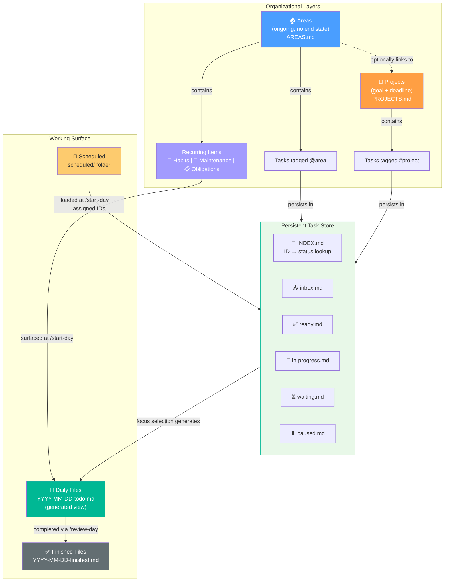
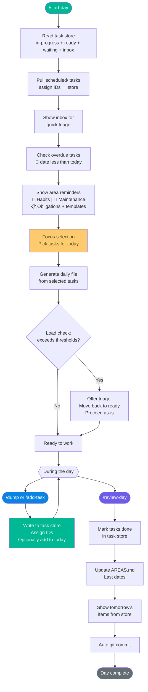
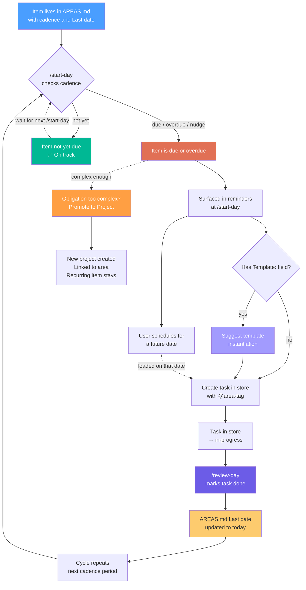
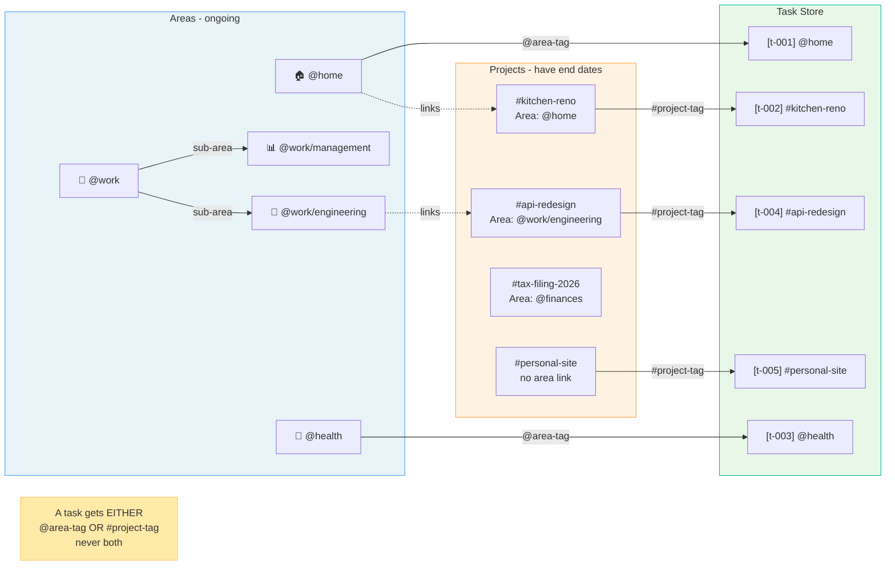
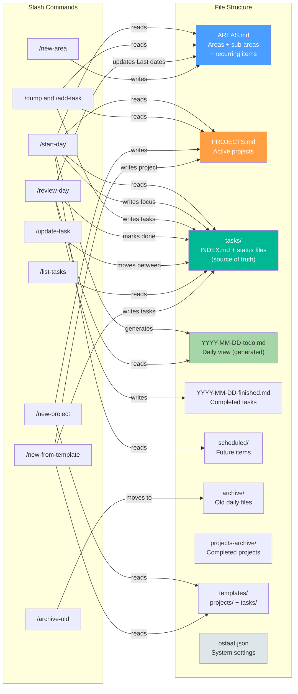

# One Step at a Time (OStaaT) — System Architecture

**Version:** 4.0.0
**Last Updated:** 2026-03-19

This document explains how the OStaaT system works from end to end. It is intended for someone picking up this system for the first time — or for future-you when you need a refresher on why things are the way they are.

---

## What This System Is

OStaaT is a markdown-based task management system powered by Claude Code slash commands. There is no application code, no database, no server. Everything is:

- **Markdown files** — human-readable, version-controlled, portable
- **Claude Code slash commands** — defined in the plugin's `commands/` directory, invoked as `/start-day`, `/dump`, etc.
- **Git** — automatic commits after every meaningful action

Claude Code acts as both the engine and the interface. You talk to it, it reads and writes markdown files, and commits the changes.

---

## 1. System Overview — The PARA Hierarchy

The system follows a modified [PARA method](https://fortelabs.com/blog/para/) (Projects, Areas, Resources, Archives). The two primary organizational layers are **Areas** and **Projects**, which sit above a **persistent task store**.


```mermaid
flowchart TD
    subgraph PARA["Organizational Layers"]
        direction TB
        A["🏠 Areas\n(ongoing, no end state)\nAREAS.md"]
        P["🎯 Projects\n(goal + deadline)\nPROJECTS.md"]
        RI["Recurring Items\n🧘 Habits | 🔄 Maintenance | 📋 Obligations"]
        T_area["Tasks tagged @area"]
        T_proj["Tasks tagged #project"]
    end

    subgraph Store["Persistent Task Store"]
        IDX["📇 INDEX.md\nID → status lookup"]
        INB["📥 inbox.md"]
        RDY["✅ ready.md"]
        INP["🔨 in-progress.md"]
        WAIT["⏳ waiting.md"]
        PAUSE["⏸️ paused.md"]
    end

    subgraph Surface["Working Surface"]
        DF["📄 Daily Files\nYYYY-MM-DD-todo.md\n(generated view)"]
        FF["✅ Finished Files\nYYYY-MM-DD-finished.md"]
        SF["📅 Scheduled\nscheduled/ folder"]
    end

    A -->|contains| RI
    A -.->|optionally links to| P
    P -->|contains| T_proj
    A -->|contains| T_area
    T_area -->|persists in| Store
    T_proj -->|persists in| Store
    RI -->|"surfaced at /start-day"| DF
    Store -->|"focus selection generates"| DF
    DF -->|"completed via /review-day"| FF
    SF -->|"loaded at /start-day → assigned IDs"| Store

    style A fill:#4a9eff,color:#fff
    style P fill:#ff9f43,color:#fff
    style RI fill:#a29bfe,color:#fff
    style Store fill:#e8f8e8,stroke:#00b894
    style DF fill:#00b894,color:#fff
    style FF fill:#636e72,color:#fff
    style SF fill:#fdcb6e,color:#333
```

### Key relationships

- **Areas** are ongoing responsibilities with no end state (Home, Health, Finances). They live in `AREAS.md` and contain recurring items across three tiers. Areas support hierarchy via path-based tags: `@work/engineering`.
- **Projects** have a clear goal and a deadline (Kitchen Renovation, Tax Filing 2026). They live in `PROJECTS.md`.
- **A project can optionally belong to an area** — e.g., `#kitchen-reno` links to `@home`. This gives the project context without duplicating structure.
- **Tasks** are the atomic unit of work. Each task has a unique ID (`t-NNN`), belongs to either a project (`#tag`) or an area (`@tag`), never both. Tasks persist in the **task store** across days.
- **The task store** (`tasks/` directory) is the **source of truth**. Tasks live in status-sharded files (inbox, ready, in-progress, waiting, paused). `INDEX.md` provides fast lookups.
- **Daily files** are **generated views**. `/start-day` reads the task store, presents focus selection, and generates today's file. No more rolling forward.

---

## 2. Data Model — Persistent Task Store

### Task lifecycle

```
inbox → ready → in-progress → done
                    ↕
                 waiting
                    ↕
                  paused
```

| Status | File | Meaning |
|--------|------|---------|
| inbox | `tasks/inbox.md` | Captured but not triaged |
| ready | `tasks/ready.md` | Actionable backlog |
| in-progress | `tasks/in-progress.md` | Selected for today's focus |
| waiting | `tasks/waiting.md` | Blocked on externals |
| paused | `tasks/paused.md` | Deliberately deferred |
| done | INDEX.md only | Completed — written to daily finished file |

### Status vs Timing

These are orthogonal dimensions:
- **Status** = which file the task lives in (lifecycle position)
- **Timing** (⏰ Now / ⏭️ Next / 📅 Later) = urgency *within* a status

### Task format

```markdown
- [t-NNN] 🔴 High ⏰ Now 🔧 45 min 📅 2026-03-20 #project-tag
  Task description
  Dependencies: t-012, t-015
  Context: See design doc
  Lead: 3d
  Created: 2026-03-15
  Focus-dates: 2026-03-17, 2026-03-18
```

Key fields: ID (always), priority, timing, active time, description, created date. Optional: passive time, energy label, due date, tag, dependencies, context, lead time, start date, waiting-on/expected, paused-reason, focus-dates.

### Subtasks

Tasks support one level of nesting. Subtasks have their own IDs, time estimates, and energy labels. They inherit the parent's tag and live in the same status file.

```markdown
- [t-030] 🔴 High 🔧 95 min #monthly-close
  Monthly financial close (1/4 done)
  - [t-031] 🔧 30 min ⚡ Admin — Pull bank statements
  - [t-032] 🔧 30 min 🧠 Deep — Reconcile accounts (done)
  - [t-033] 🔧 20 min ⚡ Admin — Generate reports
  - [t-034] 🔧 15 min ⚡ Admin — Submit to accounting
```

See `docs/TASKS-DESIGN.md` for the full specification.

---

## 3. Daily Workflow

A typical day follows a three-beat rhythm: start, work, review.


```mermaid
flowchart TD
    Start(["/start-day"]) --> ReadStore["Read task store\nin-progress + ready + waiting + inbox"]
    ReadStore --> Scheduled["Pull scheduled/ tasks\nassign IDs → store"]
    Scheduled --> Triage["Show inbox for\nquick triage"]
    Triage --> Overdue["Check overdue tasks\n📅 date less than today"]
    Overdue --> Areas["Show area reminders\n🧘 Habits | 🔄 Maintenance\n📋 Obligations + templates"]
    Areas --> Focus["Focus selection\nPick tasks for today"]
    Focus --> Generate["Generate daily file\nfrom selected tasks"]
    Generate --> Load{"Load check:\nexceeds thresholds?"}
    Load -->|Yes| TriageLoad["Offer triage:\nMove back to ready\nProceed as-is"]
    Load -->|No| Ready["Ready to work"]
    TriageLoad --> Ready

    Ready --> Work{{"During the day"}}
    Work --> Dump(["/dump or /add-task"])
    Dump --> TaskStore["Write to task store\nAssign IDs\nOptionally add to today"]
    TaskStore --> Work

    Work --> Review(["/review-day"])
    Review --> Complete["Mark tasks done\nin task store"]
    Complete --> UpdateAreas["Update AREAS.md\nLast dates"]
    UpdateAreas --> Upcoming["Show tomorrow's\nitems from store"]
    Upcoming --> Commit["Auto git commit"]
    Commit --> Done(["Day complete"])

    style Start fill:#00b894,color:#fff
    style Dump fill:#0984e3,color:#fff
    style Review fill:#6c5ce7,color:#fff
    style Done fill:#636e72,color:#fff
    style TaskStore fill:#00b894,color:#fff
    style Focus fill:#fdcb6e,color:#333
```

### Why this flow matters

**`/start-day` reads the task store, not yesterday's file.** No more rolling forward. Tasks persist in the store across days. Focus selection lets you pick what matters today from your full backlog — including items that became ready due to lead time or start dates.

**`/dump` and `/add-task` write to the task store first.** Tasks get unique IDs immediately. You can optionally add them to today's focus, or leave them in the backlog for the next `/start-day`.

**`/review-day` syncs completions back to the store.** Completed tasks are removed from status files, INDEX.md is updated, and the task goes to the finished file. Area recurring items get their Last date updated. No carry-over notes needed — `Focus-dates` tracks history.

### Key difference from v3

| v3 | v4 |
|----|-----|
| Tasks live in daily files | Tasks live in the task store |
| Rolling forward copies tasks | Tasks persist — no copying needed |
| `📌 Carried over from:` notes | `Focus-dates:` tracks work history |
| No global view of open work | INDEX.md + status files give full visibility |
| Tasks are incomplete or complete | Six lifecycle states |

---

## 4. Area Item Lifecycle

Recurring items are the heartbeat of the Areas system. They follow a cycle: live in `AREAS.md`, get surfaced when due, get worked on as tasks in the store, and update their "Last" date when completed.


```mermaid
flowchart TD
    Lives["Item lives in AREAS.md\nwith cadence and Last date"]
    Check{"/start-day\nchecks cadence"}
    Due["Item is due or overdue"]
    NotDue["Item not yet due\n✅ On track"]
    Surface["Surfaced in reminders\nat /start-day"]
    Template{"Has Template: field?"}
    InstTemplate["Suggest template\ninstantiation"]
    AddTask["Create task in store\nwith @area-tag"]
    Future["User schedules for\na future date"]
    WorkOn["Task in store\n→ in-progress"]
    ReviewDay["/review-day\nmarks task done"]
    UpdateLast["AREAS.md Last date\nupdated to today"]
    Cycle["Cycle repeats\nnext cadence period"]
    Promote["Obligation too complex?\nPromote to Project"]

    Lives --> Check
    Check -->|"due / overdue / nudge"| Due
    Check -->|"not yet"| NotDue
    NotDue -.->|"wait for next /start-day"| Check
    Due --> Surface
    Surface --> Template
    Template -->|yes| InstTemplate
    Template -->|no| AddTask
    InstTemplate --> AddTask
    Surface --> Future
    Future -.->|"loaded on that date"| AddTask
    AddTask --> WorkOn
    WorkOn --> ReviewDay
    ReviewDay --> UpdateLast
    UpdateLast --> Cycle
    Cycle --> Check
    Due -.->|"complex enough"| Promote
    Promote --> NewProject["New project created\nLinked to area\nRecurring item stays"]

    style Lives fill:#4a9eff,color:#fff
    style Due fill:#e17055,color:#fff
    style NotDue fill:#00b894,color:#fff
    style ReviewDay fill:#6c5ce7,color:#fff
    style UpdateLast fill:#fdcb6e,color:#333
    style Promote fill:#ff9f43,color:#fff
    style InstTemplate fill:#a29bfe,color:#fff
```

### How the cycle works

1. **The item lives in `AREAS.md`** with a description, cadence, and the date it was last completed.
2. **`/start-day` checks the math.** If today's date minus the "Last" date exceeds the cadence, the item shows up in reminders.
3. **Template integration**: If the item has a `Template:` field (e.g., `Template: monthly-close`) and a `Lead: Nd` time, the system suggests instantiation when the lead time triggers. This creates tasks in the task store from the template.
4. **You add it to the task store** as a task with `@area-tag` and `🔄 Recurring` notation — or schedule for a future date.
5. **You complete it** during `/review-day`, and the system updates the "Last" date in `AREAS.md`.
6. **The cycle resets.** Next time `/start-day` runs and the cadence has elapsed, the item surfaces again.

### Area hierarchy

Areas support path-based sub-areas:
- `@work` has sub-areas `@work/engineering` and `@work/management`
- Parent areas can have their own recurring items
- Tasks tagged `@work/engineering` are scoped to that sub-area
- In Phase 2, energy blocks can be area-scoped

---

## 5. Project-Area Relationship

Projects and Areas serve different purposes but connect through a clear linking system.


```mermaid
flowchart LR
    subgraph AreaLayer["Areas - ongoing"]
        Home["🏠 @home"]
        Work["💼 @work"]
        WorkEng["🔧 @work/engineering"]
        WorkMgmt["📊 @work/management"]
        Health["💪 @health"]
    end

    subgraph ProjectLayer["Projects - have end dates"]
        KR["#kitchen-reno\nArea: @home"]
        API["#api-redesign\nArea: @work/engineering"]
        Tax["#tax-filing-2026\nArea: @finances"]
        Web["#personal-site\nno area link"]
    end

    subgraph TaskStore["Task Store"]
        T1["[t-001] @home"]
        T2["[t-002] #kitchen-reno"]
        T3["[t-003] @health"]
        T4["[t-004] #api-redesign"]
        T5["[t-005] #personal-site"]
    end

    Work -->|sub-area| WorkEng
    Work -->|sub-area| WorkMgmt
    Home -.->|"links"| KR
    WorkEng -.->|"links"| API

    Home -->|"@area-tag"| T1
    KR -->|"#project-tag"| T2
    Health -->|"@area-tag"| T3
    API -->|"#project-tag"| T4
    Web -->|"#project-tag"| T5

    MutEx["A task gets EITHER\n@area-tag OR #project-tag\nnever both"]

    style AreaLayer fill:#e8f4f8,stroke:#4a9eff
    style ProjectLayer fill:#fef3e2,stroke:#ff9f43
    style TaskStore fill:#e8f8e8,stroke:#00b894
    style MutEx fill:#ffeaa7,color:#333,stroke:#fdcb6e
```

### Why mutual exclusivity?

A task tagged `#kitchen-reno` already inherits its area context from the project's `**Area:** @home` field. If the task also had `@home`, that would be redundant and create ambiguity. The rule is simple:

- **If the task is part of a project**, use `#project-tag`. The area context comes from the project.
- **If the task is a standalone area responsibility** (not part of any project), use `@area-tag`.

---

## 6. File Structure and Command Relationships


```mermaid
flowchart LR
    subgraph Files["File Structure"]
        AREAS["AREAS.md\nAreas + sub-areas\n+ recurring items"]
        PROJECTS["PROJECTS.md\nActive projects"]
        STORE["tasks/\nINDEX.md + status files\n(source of truth)"]
        TODO["YYYY-MM-DD-todo.md\nDaily view (generated)"]
        FINISHED["YYYY-MM-DD-finished.md\nCompleted tasks"]
        SCHED["scheduled/\nFuture items"]
        ARCHIVE["archive/\nOld daily files"]
        PROJARCH["projects-archive/\nCompleted projects"]
        TEMPLATES["templates/\nprojects/ + tasks/"]
        CONFIG["ostaat.json\nSystem settings"]
    end

    subgraph Commands["Slash Commands"]
        SD["/start-day"]
        DMP["/dump and /add-task"]
        RD["/review-day"]
        UT["/update-task"]
        LT["/list-tasks"]
        NP["/new-project"]
        NFT["/new-from-template"]
        NA["/new-area"]
        AO["/archive-old"]
    end

    SD -->|"reads"| STORE
    SD -->|"reads"| AREAS
    SD -->|"reads"| PROJECTS
    SD -->|"reads"| SCHED
    SD -->|"generates"| TODO
    SD -->|"writes focus"| STORE

    DMP -->|"writes tasks"| STORE
    DMP -->|"reads"| PROJECTS
    DMP -->|"reads"| AREAS

    RD -->|"reads"| TODO
    RD -->|"marks done"| STORE
    RD -->|"writes"| FINISHED
    RD -->|"updates Last dates"| AREAS

    UT -->|"moves between"| STORE
    LT -->|"reads"| STORE

    NP -->|"writes"| PROJECTS
    NP -->|"reads"| TEMPLATES
    NFT -->|"reads"| TEMPLATES
    NFT -->|"writes tasks"| STORE
    NFT -->|"writes project"| PROJECTS

    NA -->|"writes"| AREAS
    AO -->|"moves to"| ARCHIVE

    style STORE fill:#00b894,color:#fff
    style AREAS fill:#4a9eff,color:#fff
    style PROJECTS fill:#ff9f43,color:#fff
    style TODO fill:#a5d6a7,color:#333
    style CONFIG fill:#dfe6e9,color:#333
```

### File-by-file breakdown

| File | Purpose | Created by | Updated by |
|------|---------|------------|------------|
| `tasks/INDEX.md` | Task ID → status + summary lookup | `/setup` | All task-writing commands |
| `tasks/{status}.md` | Tasks sharded by lifecycle status | `/setup` | `/add-task`, `/dump`, `/update-task`, `/start-day`, `/review-day` |
| `AREAS.md` | Areas, sub-areas, and recurring items | `/new-area` | `/update-area`, `/review-day` |
| `PROJECTS.md` | Active projects with status and progress | `/new-project` | `/update-project`, `/review-day`, `/link-task` |
| `YYYY-MM-DD-todo.md` | Today's working view (generated from store) | `/start-day` | `/dump`, `/add-task`, `/refine`, `/link-task` |
| `YYYY-MM-DD-finished.md` | Completed tasks for the day | `/start-day` | `/review-day` |
| `scheduled/` | Lightweight future items (not in task store) | `/dump`, `/add-task` | `/start-day` (reads, assigns IDs, removes) |
| `archive/` | Daily files older than 3 days | `/archive-old` | -- |
| `projects-archive/` | Completed project files | `/update-project` | `/reopen-project` |
| `templates/projects/` | Project-only templates | Manual | Manual |
| `templates/tasks/` | Unified task/project templates | Manual | Manual |
| `ostaat.json` | Config, feature flags, nextId | `/setup` | Task-writing commands (nextId) |

---

## 7. Three-Tier Recurring Items

Not all recurring items are created equal. The three-tier system reflects reality: some things are gentle habits, some are periodic chores, and some carry real consequences if you miss them.

### Tier details

#### 🧘 Habits — "Did you do this today?"
- **Cadence:** Daily, or "4x/week"
- **When missed:** Gentle `🟡 Nudge`. No alarm bells.
- **Tracking:** For "X times per week", shows `This week: 2/4`.

#### 🔄 Maintenance — "This needs doing eventually"
- **Cadence:** Weekly, monthly, seasonal.
- **When missed:** Gentle `🟡 Nudge`. Notes how long it's been.
- **Seasonal:** Items can show `💤 Off-season` outside their active window.

#### 📋 Obligations — "This has a deadline and consequences"
- **Cadence:** Monthly, yearly, specific dates.
- **When missed:** `🔴 Overdue (N days)` with consequence text surfaced.
- **Consequences documented:** `⚠️ If missed: Late fee ($50). After 30 days: credit score impact`
- **Template support:** Can reference a template for automatic task creation when due.
- **Promotion:** Can become a project when complex enough.

---

## 8. Energy Calendar & Capacity Planning

The energy calendar adds time-aware scheduling. It defines when you have capacity for different types of work, scoped to areas.

### How it works

- **Energy dimensions** are user-defined work categories (🧠 Deep, ⚡ Admin, 🎨 Creative, 🤝 Social)
- **Energy blocks** are time slots in `ENERGY-CALENDAR.md` with weekly defaults and date overrides
- Each block has an energy type and area scope: `09:00-12:00 🧠 Deep @work`
- **Area scoping** means a `@work` block serves `@work`, `@work/engineering`, etc.

### Integration points

| Command | Energy feature |
|---------|---------------|
| `/start-day` | Shows energy budget, fit indicators during focus selection, constraint warnings |
| `/allocate-time` | Matches tasks to blocks by energy type and area, proposes schedule |
| `/review-day` | Energy usage report (utilization by type) |
| `/energy-calendar` | View and edit weekly defaults, add overrides, capacity overview |
| `/add-task`, `/dump` | Suggest energy labels from configured dimensions |

### Constraint engine

For tasks with due dates, the system works backward through available energy blocks to determine the latest viable start date. If capacity is insufficient, it flags the shortfall before you're surprised.

See `docs/ENERGY-DESIGN.md` for the full specification.

---

## Task Format Reference

```markdown
- [t-NNN] 🔴 High ⏰ Now 🔧 45 min 🧠 Deep 📅 2026-03-05 #project-tag
  Task description
  Dependencies: t-012
  Context: See API design doc
  Lead: 3d
  Created: 2026-02-24
  Focus-dates: 2026-03-03, 2026-03-04, 2026-03-05
```

| Field | Required | Values |
|-------|----------|--------|
| ID | Yes | `[t-NNN]` — unique, sequential, never recycled |
| Priority | Yes | 🔴 High, 🟡 Medium, 🟢 Low |
| Timing | Yes | ⏰ Now, ⏭️ Next, 📅 Later |
| Active time | Yes | 🔧 N min (hands-on work time) |
| Passive time | No | 🕓 N min (waiting/background time) |
| Energy label | No | User-defined (e.g., 🧠 Deep, ⚡ Admin) |
| Due date | No | 📅 YYYY-MM-DD |
| Tag | No | `#project-tag` or `@area/sub` (mutually exclusive) |
| Description | Yes | Second line, indented |
| Dependencies | No | Task IDs (e.g., t-012, t-015) |
| Context | No | Links, notes, resources |
| Lead | No | Nd — surface N days before due date |
| Start | No | YYYY-MM-DD — explicit start date (overrides Lead) |
| Created | Yes (auto) | Date task was created |
| Focus-dates | Auto | Days this task was in focus |

---

## Slash Commands Quick Reference

### Daily Workflow
| Command | Purpose |
|---------|---------|
| `/start-day` | Read task store, select focus, generate daily file |
| `/dump` | Quick capture → task store with IDs |
| `/brain-dump` | Guided brain dump → task store |
| `/add-task` | Single task with guided questions → task store |
| `/review-day` | Mark done in task store, update areas, show upcoming |
| `/refine` | Break down into subtasks with IDs, adjust details |
| `/archive-old` | Move daily files older than 3 days to `archive/` |

### Task Management
| Command | Purpose |
|---------|---------|
| `/list-tasks` | Query task store by status, project, area, priority |
| `/update-task` | Change status, timing, waiting info, move between states |
| `/link-task` | Add `#project-tag` or `@area-tag` to tasks |

### Projects
| Command | Purpose |
|---------|---------|
| `/new-project` | Create project from scratch, template, or duplicate |
| `/list-projects` | Show all projects with status and progress |
| `/update-project` | Update status, priority, timeline; archive when complete |
| `/reopen-project` | Pull archived project back to active |
| `/review-projects` | Weekly review with progress analysis |

### Areas
| Command | Purpose |
|---------|---------|
| `/new-area` | Create area or sub-area with recurring items |
| `/list-areas` | Show all areas with item statuses |
| `/update-area` | Manage items, sub-areas, promote to project |
| `/review-areas` | Periodic area review with health checks |

### Templates & Migration
| Command | Purpose |
|---------|---------|
| `/new-from-template` | Instantiate a unified task/project template |
| `/upgrade` | Upgrade workspace from any previous version to latest |
| `/migrate-tasks` | Extract tasks from daily files into task store |

### External Integrations
| Command | Purpose |
|---------|---------|
| `/allocate-time` | Schedule tasks against energy blocks and Google Calendar |
| `/energy-calendar` | View and manage energy calendar (weekly defaults, overrides) |
| `/pull` | Import tasks from Jira, GitHub, Slack, Google Docs |

### Help & Maintenance
| Command | Purpose |
|---------|---------|
| `/ostaat-help` | Interactive help and command reference |
| `/ostaat-unlock` | Force-break a stale workspace lock |

---

## Design Philosophy

The system is built on five principles:

1. **Reduce friction** — Task capture takes seconds. IDs are auto-assigned. Templates eliminate repetitive setup.

2. **Create clarity** — Six lifecycle states, three recurring tiers, area hierarchy, clear tag rules. You always know where something lives and what state it's in.

3. **Bias toward action** — Focus selection surfaces what matters today. Lead times and start dates bring tasks forward automatically. Quick wins build momentum.

4. **Emotional safety** — The system says "12 tasks today (threshold: 8)" not "you're overwhelmed." Resistance tracking is opt-in. Incomplete tasks persist without judgment.

5. **Don't invent** — The system only tracks what you explicitly tell it. No auto-generated subtasks, no inferred priorities, no fabricated deadlines.

---

## How It All Fits Together

OStaaT manages attention across different time horizons:

- **Areas** manage the long game — ongoing responsibilities that never end, with optional sub-area hierarchy.
- **Projects** manage the medium game — focused efforts with a finish line.
- **The task store** manages all open work — with lifecycle states, dependencies, and IDs for every task.
- **Daily files** manage today — a generated view of what you chose to focus on.
- **Templates** capture reusable workflows — instantiate with variables when needed.
- **Due dates and lead times** create urgency signals that cut across all layers.
- **Git commits** create an automatic audit trail.

The slash commands move information between these layers. `/start-day` reads the store and generates your daily view. `/review-day` pushes completions back to the store and areas. `/new-from-template` turns a recipe into concrete tasks. The cycle repeats every day, and the task store gives you full visibility into all open work at any time.

No apps to install. No accounts to create. Just markdown, git, and Claude.
