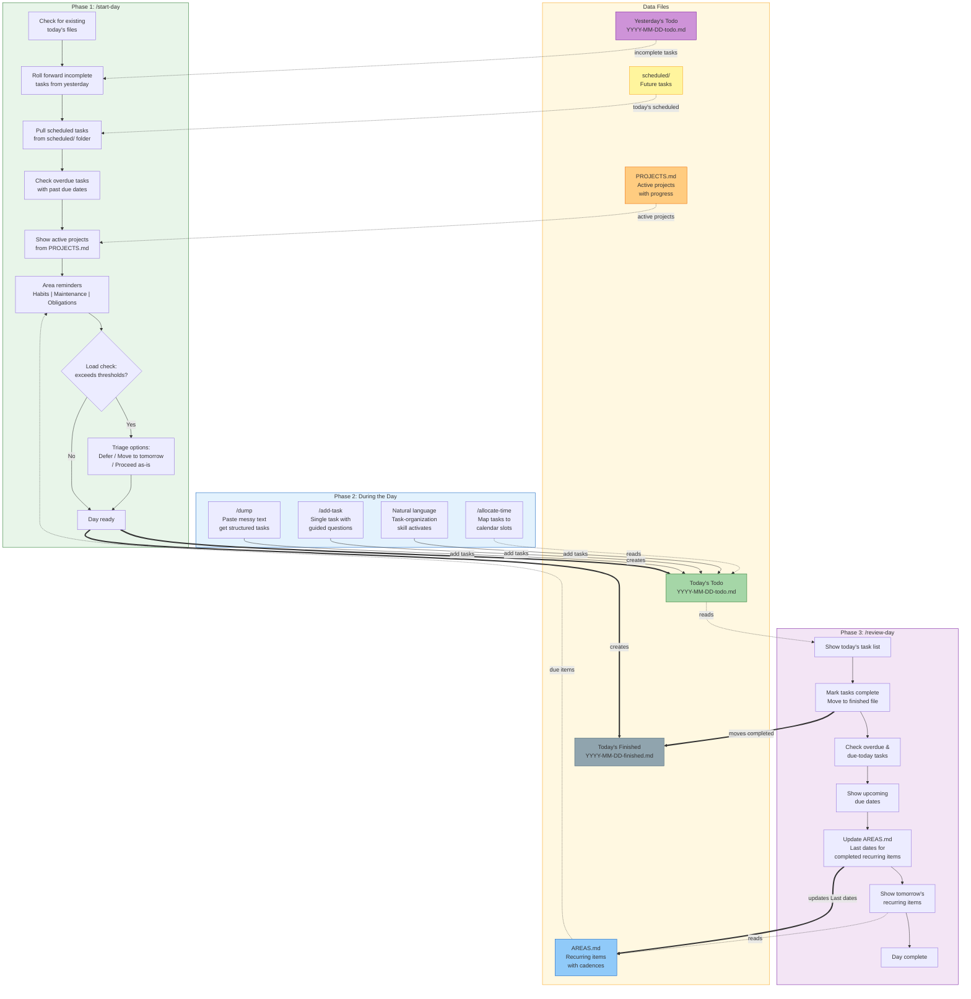

# Using OStaaT — Slash Commands vs Natural Language

OStaaT gives you two ways to interact: **slash commands** and **natural language**. Both work from any directory — you don't need to be in your OStaaT workspace.

---

## Slash Commands

Slash commands are the primary interface. Each one loads a structured prompt that tells Claude exactly what to do — which files to read, what to write, what questions to ask, and what format to use.

```
/start-day          → Initialize today, roll forward tasks, show reminders
/dump               → Quick task capture from messy input
/add-task           → Add a single task with guided questions
/review-day         → Mark tasks complete, update areas, show upcoming
/refine             → Break down or reprioritize existing tasks
```

**When to use slash commands:**
- You want a specific, repeatable workflow
- You need the full feature set (load checks, area reminders, git commits)
- You want consistent behavior every time

See the [full command list](#all-commands) below.

---

## Daily Planning Flow

The daily workflow follows a three-phase rhythm: **start, work, review**. Each phase reads from and writes to shared markdown files.



**Reading the diagram:**
- **Dashed arrows** = reads from a file
- **Thick arrows** = creates or writes to a file
- The cycle between AREAS.md and the phases is key: `/start-day` reads it for reminders, `/review-day` writes back completion dates
- All mid-day capture methods (slash commands and natural language) converge on a single file — today's todo

---

## Natural Language

OStaaT includes 5 proactive skills that respond to natural language. When you talk about tasks, planning, or life management, Claude recognizes the intent and either helps directly or suggests the right slash command.

### What triggers skills

| You say... | Skill activated | What happens |
|------------|----------------|--------------|
| "I need to finish the report and call my accountant" | task-organization | Structures your tasks into OStaaT format and adds to today's file |
| "How's my day looking?" | daily-workflow | Reads your daily file, checks priorities, helps you focus |
| "I'm done for today" | daily-workflow | Suggests `/review-day` to close out |
| "I want to track home maintenance" | area-management | Helps create an area with recurring items |
| "The kitchen reno is behind schedule" | project-management | Helps update project status and timeline |

### How skills work

Skills are **routers, not replacements**. They recognize your intent and guide you to the right workflow:

- **task-organization** is the one skill that can do the full capture-and-write flow itself, structuring messy input into tasks without needing `/dump`
- **daily-workflow** suggests `/start-day`, `/review-day`, etc. at the right times based on context
- **area-management** and **project-management** help with questions and suggest the appropriate commands
- **workspace-resolution** runs automatically before any command to find your data files

### Slash commands vs natural language

| | Slash commands | Natural language |
|---|---|---|
| **Activation** | Deterministic — always runs exactly as designed | Probabilistic — Claude matches your intent to skill descriptions |
| **Scope** | Full structured prompt with all edge cases handled | Skill provides guidance but is looser |
| **Consistency** | Same behavior every time | May vary based on phrasing |
| **Best for** | Structured workflows (start of day, end of day, reviews) | Quick captures, questions, exploring what's available |

### Practical guidance

- **Starting and ending your day**: Use `/start-day` and `/review-day` — these do a lot of file management that benefits from the full command
- **Capturing tasks mid-flow**: Natural language works great — just say what you need to do and the task-organization skill handles it
- **Project and area management**: Start with natural language to explore, then use the commands when you're ready to make changes
- **When in doubt**: Use the slash command — it's always the more complete path

---

## Workspace Locking

OStaaT uses a central workspace that multiple Claude Code sessions can access simultaneously. To prevent data corruption from concurrent writes, the system uses **advisory file locking**.

### How it works

- **Write commands** (like `/start-day`, `/dump`, `/review-day`) automatically acquire a lock before writing and release it when done.
- **Read-only commands** (`/list-projects`, `/list-areas`, `/ostaat-help`) never lock — they're always safe to run.
- The lock file is `{workspace_root}/.ostaat.lock` — it contains a session identifier and timestamp.

### What happens with conflicts

If you run a write command while another Claude session holds the lock:
```
🔒 Workspace is locked by another session.
Locked by: /dump at 2026-03-17T14:30:00Z (from ~/code/my-project)
Lock age: 3 minutes
```

The command will not proceed. Wait for the other session to finish, or force-break with `/ostaat-unlock`.

### Stale locks

Locks auto-expire after **10 minutes**. If a session crashes without releasing its lock, the next command will detect the stale lock and auto-break it. You can also manually break a lock with `/ostaat-unlock --force`.

### Important notes

- The lock file is in `.gitignore` — it's never committed
- Long interactive commands (like `/start-day` which asks several questions) refresh the lock timestamp to prevent false expiry
- If you frequently hit lock conflicts, consider keeping OStaaT work in one Claude session at a time

---

## Getting Help

- Run `/ostaat-help` for an interactive overview of all commands and skills
- Say "how does OStaaT work?" or "what can OStaaT do?" for natural language help
- Run `/ostaat-help <command>` for details on a specific command (e.g., `/ostaat-help dump`)

---

## All Commands

### Setup
| Command | Description |
|---------|-------------|
| `/setup` | Initialize OStaaT workspace (central or per-project) |

### Daily Workflow
| Command | Description |
|---------|-------------|
| `/start-day` | Initialize today, roll forward tasks, show reminders |
| `/dump` | Quick task capture from messy input |
| `/brain-dump` | Full guided brain dump |
| `/add-task` | Add a single task with guided questions |
| `/review-day` | Mark complete, review upcoming items |
| `/refine` | Refine existing tasks |
| `/archive-old` | Archive files older than 3 days |

### Projects
| Command | Description |
|---------|-------------|
| `/new-project` | Create a new project |
| `/list-projects` | Show all projects with status |
| `/update-project` | Update project details or archive |
| `/link-task` | Link tasks to projects or areas |
| `/reopen-project` | Restore archived project |
| `/review-projects` | Weekly project review |

### Areas
| Command | Description |
|---------|-------------|
| `/new-area` | Create a new area of responsibility |
| `/list-areas` | Show areas with recurring item status |
| `/update-area` | Manage recurring items, promote to project |
| `/review-areas` | Periodic area review |

### Integrations
| Command | Description |
|---------|-------------|
| `/allocate-time` | Schedule against Google Calendar |
| `/pull` | Pull from Jira, GitHub, Slack |

### Help & Maintenance
| Command | Description |
|---------|-------------|
| `/ostaat-help` | Interactive help and command reference |
| `/ostaat-unlock` | Force-break a stale workspace lock |
