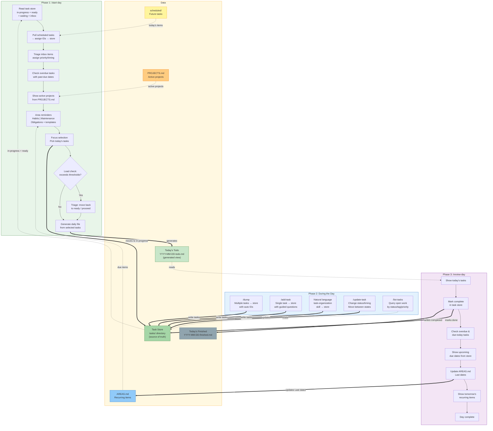

# Using OStaaT — Slash Commands vs Natural Language

OStaaT gives you two ways to interact: **slash commands** and **natural language**. Both work from any directory — you don't need to be in your OStaaT workspace.

---

## Slash Commands

Slash commands are the primary interface. Each one loads a structured prompt that tells Claude exactly what to do — which files to read, what to write, what questions to ask, and what format to use.

```
/start-day          → Read task store, select focus, generate daily file
/dump               → Quick task capture → task store with IDs
/add-task           → Single task with guided questions → task store
/review-day         → Mark done in task store, update areas, show upcoming
/refine             → Break down into subtasks with IDs, adjust details
/list-tasks         → Query task store by status, project, area
/update-task        → Change task status, move between lifecycle states
```

**When to use slash commands:**
- You want a specific, repeatable workflow
- You need the full feature set (task IDs, store sync, git commits)
- You want consistent behavior every time

See the [full command list](#all-commands) below.

---

## Daily Planning Flow

The daily workflow follows a three-phase rhythm: **start, work, review**. The **task store** (`tasks/` directory) is the source of truth throughout.


```mermaid
flowchart TD
    subgraph Morning["Phase 1: /start-day"]
        direction TB
        M1["Read task store\nin-progress + ready\n+ waiting + inbox"]
        M2["Pull scheduled tasks\n→ assign IDs → store"]
        M3["Triage inbox items\nassign priority/timing"]
        M4["Check overdue tasks\nwith past due dates"]
        M5["Show active projects\nfrom PROJECTS.md"]
        M6["Area reminders\nHabits | Maintenance\nObligations + templates"]
        M7["Focus selection\nPick today's tasks"]
        M8{"Load check:\nexceeds thresholds?"}
        M9["Triage: move back\nto ready / proceed"]
        M10["Generate daily file\nfrom selected tasks"]

        M1 --> M2 --> M3 --> M4 --> M5 --> M6 --> M7 --> M8
        M8 -->|Yes| M9 --> M10
        M8 -->|No| M10
    end

    subgraph MidDay["Phase 2: During the Day"]
        direction TB
        D1["/dump\nMultiple tasks → store\nwith auto IDs"]
        D2["/add-task\nSingle task → store\nwith guided questions"]
        D3["Natural language\ntask-organization\nskill → store"]
        D4["/update-task\nChange status/timing\nMove between states"]
        D5["/list-tasks\nQuery open work\nby status/tag/priority"]
    end

    subgraph Evening["Phase 3: /review-day"]
        direction TB
        E1["Show today's tasks"]
        E2["Mark complete\nin task store"]
        E3["Check overdue &\ndue-today tasks"]
        E4["Show upcoming\ndue dates from store"]
        E5["Update AREAS.md\nLast dates"]
        E6["Show tomorrow's\nrecurring items"]
        E7["Day complete"]

        E1 --> E2 --> E3 --> E4 --> E5 --> E6 --> E7
    end

    subgraph Files["Data"]
        direction LR
        STORE["Task Store\ntasks/ directory\n(source of truth)"]
        TODO["Today's Todo\nYYYY-MM-DD-todo.md\n(generated view)"]
        DONE["Today's Finished\nYYYY-MM-DD-finished.md"]
        AREAS["AREAS.md\nRecurring items"]
        PROJ["PROJECTS.md\nActive projects"]
        SCHED["scheduled/\nFuture tasks"]
    end

    STORE -.->|"in-progress + ready"| M1
    SCHED -.->|"today's items"| M2
    AREAS -.->|"due items"| M6
    PROJ -.->|"active projects"| M5
    M10 ==>|"generates"| TODO
    M7 ==>|"moves to in-progress"| STORE

    D1 & D2 & D3 ==>|"write tasks"| STORE
    D4 ==>|"updates"| STORE
    D5 -.->|"reads"| STORE

    TODO -.->|"reads"| E1
    E2 ==>|"marks done"| STORE
    E2 ==>|"writes completed"| DONE
    E5 ==>|"updates Last dates"| AREAS

    style Morning fill:#e8f5e9,stroke:#2e7d32
    style MidDay fill:#e3f2fd,stroke:#1565c0
    style Evening fill:#f3e5f5,stroke:#7b1fa2
    style Files fill:#fff8e1,stroke:#f9a825
    style STORE fill:#a5d6a7,stroke:#2e7d32
    style TODO fill:#c8e6c9,stroke:#2e7d32
    style DONE fill:#90a4ae,stroke:#546e7a
    style AREAS fill:#90caf9,stroke:#1565c0
    style PROJ fill:#ffcc80,stroke:#ef6c00
    style SCHED fill:#fff59d,stroke:#f9a825
```

**Reading the diagram:**
- **Dashed arrows** = reads from
- **Thick arrows** = writes to
- The task store is central — all writes go through it, daily file is generated from it
- Focus selection at `/start-day` replaces v3's rolling forward

---

## Natural Language

OStaaT includes 5 proactive skills that respond to natural language. When you talk about tasks, planning, or life management, Claude recognizes the intent and either helps directly or suggests the right slash command.

### What triggers skills

| You say... | Skill activated | What happens |
|------------|----------------|--------------|
| "I need to finish the report and call my accountant" | task-organization | Structures tasks, writes to task store with IDs |
| "How's my day looking?" | daily-workflow | Reads task store, checks priorities, helps you focus |
| "I'm done for today" | daily-workflow | Suggests `/review-day` to mark completions in store |
| "I want to track home maintenance" | area-management | Helps create area with sub-areas and recurring items |
| "The kitchen reno is behind schedule" | project-management | Shows task store stats for project, helps update |
| "Show me all my waiting tasks" | daily-workflow | Suggests `/list-tasks --status waiting` |

### How skills work

Skills are **routers, not replacements**. They recognize your intent and guide you to the right workflow:

- **task-organization** can do the full capture-and-write flow, structuring messy input into tasks with IDs in the task store
- **daily-workflow** suggests `/start-day`, `/review-day`, `/update-task`, `/list-tasks` at the right times
- **area-management** and **project-management** help with questions and suggest commands
- **workspace-resolution** runs automatically before any command to find your data files

### Slash commands vs natural language

| | Slash commands | Natural language |
|---|---|---|
| **Activation** | Deterministic — always runs exactly as designed | Probabilistic — Claude matches intent to skills |
| **Scope** | Full structured prompt with all edge cases | Skill provides guidance but is looser |
| **Consistency** | Same behavior every time | May vary based on phrasing |
| **Best for** | Structured workflows (start/end day, reviews) | Quick captures, questions, exploring |

---

## Task Store

The task store (`tasks/` directory) is the source of truth for all tasks. Daily files are generated views.

### Task IDs

Every task gets a unique ID: `t-001`, `t-042`, `t-117`. IDs are:
- Sequential, never recycled
- Assigned automatically on capture
- Used to reference tasks everywhere (dependencies, commands, conversation)

### Lifecycle states

```
inbox → ready → in-progress → done
                    ↕
                 waiting ↔ paused
```

Move tasks between states with `/update-task t-NNN <status>`.

### Quick commands

```
/list-tasks                       → All open tasks by status
/list-tasks --status ready        → Just the backlog
/list-tasks --tag @work           → Filter by area
/update-task t-017 waiting        → Move to waiting
/update-task t-017 done           → Mark complete
```

---

## Templates

Unified templates in `templates/tasks/` can create tasks, projects, or both:

```
/new-from-template monthly-close  → Create tasks from a reusable checklist
/new-from-template client-onboard → Create project + tasks with variables
```

Area recurring items can reference templates. When they come due, `/start-day` suggests instantiation.

---

## Workspace Locking

OStaaT uses a central workspace that multiple Claude Code sessions can access simultaneously. To prevent data corruption from concurrent writes, the system uses **advisory file locking**.

### How it works

- **Write commands** automatically acquire a lock before writing and release it when done.
- **Read-only commands** (`/list-projects`, `/list-areas`, `/list-tasks`, `/ostaat-help`) never lock — always safe.
- The lock file is `{workspace_root}/.ostaat.lock`.

### What happens with conflicts

If you run a write command while another session holds the lock:
```
🔒 Workspace is locked by another session.
Locked by: /dump at 2026-03-17T14:30:00Z (from ~/code/my-project)
Lock age: 3 minutes
```

Wait for the other session to finish, or force-break with `/ostaat-unlock`.

### Stale locks

Locks auto-expire after **10 minutes**. Stale locks are auto-broken. Manual break: `/ostaat-unlock --force`.

---

## Getting Help

- Run `/ostaat-help` for an interactive overview of all commands
- Say "how does OStaaT work?" for natural language help
- Run `/ostaat-help <command>` for details on a specific command

---

## All Commands

### Setup
| Command | Description |
|---------|-------------|
| `/setup` | Initialize OStaaT workspace with task store |

### Daily Workflow
| Command | Description |
|---------|-------------|
| `/start-day` | Read task store, select focus, generate daily file |
| `/dump` | Quick capture → task store with IDs |
| `/brain-dump` | Full guided brain dump → task store |
| `/add-task` | Single task with guided questions |
| `/review-day` | Mark complete in store, update areas |
| `/refine` | Break down into subtasks with IDs |
| `/archive-old` | Archive files older than 3 days |

### Task Management
| Command | Description |
|---------|-------------|
| `/list-tasks` | Query task store by status, tag, priority |
| `/update-task` | Change status, timing, move between states |
| `/link-task` | Link tasks to projects or areas |

### Projects
| Command | Description |
|---------|-------------|
| `/new-project` | Create project (with optional task template) |
| `/list-projects` | Show all projects with status |
| `/update-project` | Update project details or archive |
| `/reopen-project` | Restore archived project |
| `/review-projects` | Weekly project review |

### Areas
| Command | Description |
|---------|-------------|
| `/new-area` | Create area or sub-area |
| `/list-areas` | Show areas with recurring item status |
| `/update-area` | Manage items, sub-areas, promote |
| `/review-areas` | Periodic area review |

### Templates & Migration
| Command | Description |
|---------|-------------|
| `/new-from-template` | Instantiate task/project template |
| `/upgrade` | Upgrade workspace from any version to latest |
| `/migrate-tasks` | Extract tasks from daily files into store |

### Integrations
| Command | Description |
|---------|-------------|
| `/allocate-time` | Schedule against Google Calendar |
| `/pull` | Pull from Jira, GitHub, Slack |

### Help & Maintenance
| Command | Description |
|---------|-------------|
| `/ostaat-help` | Interactive help and command reference |
| `/ostaat-unlock` | Force-break a stale workspace lock |
